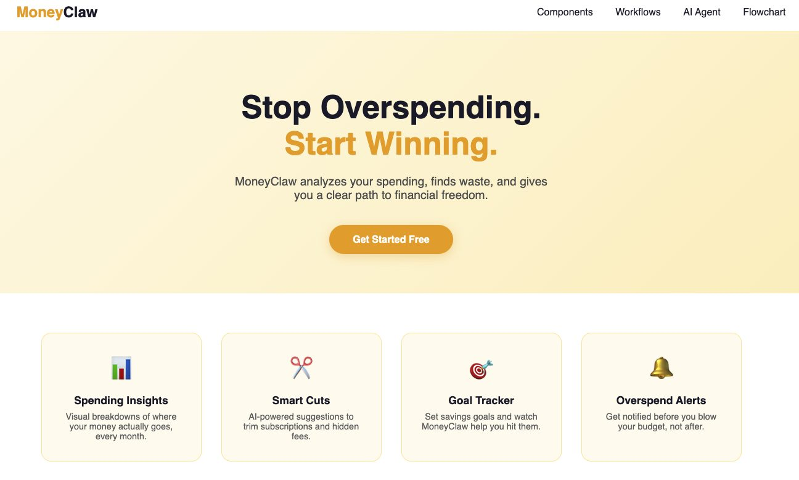
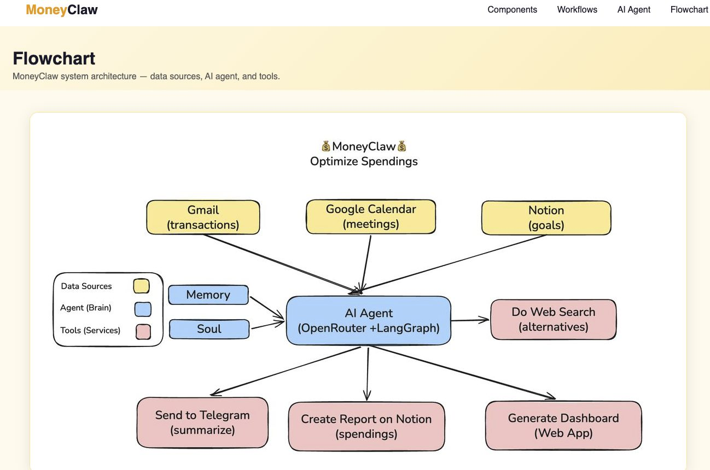
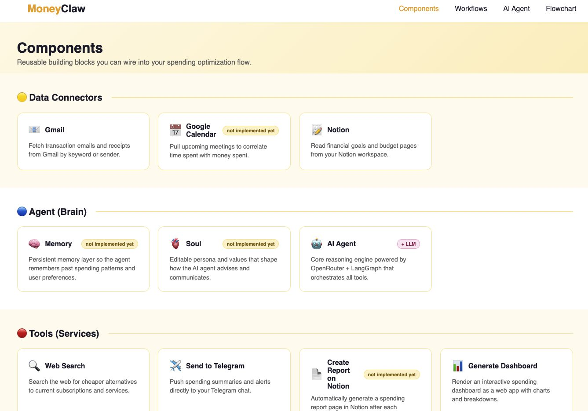
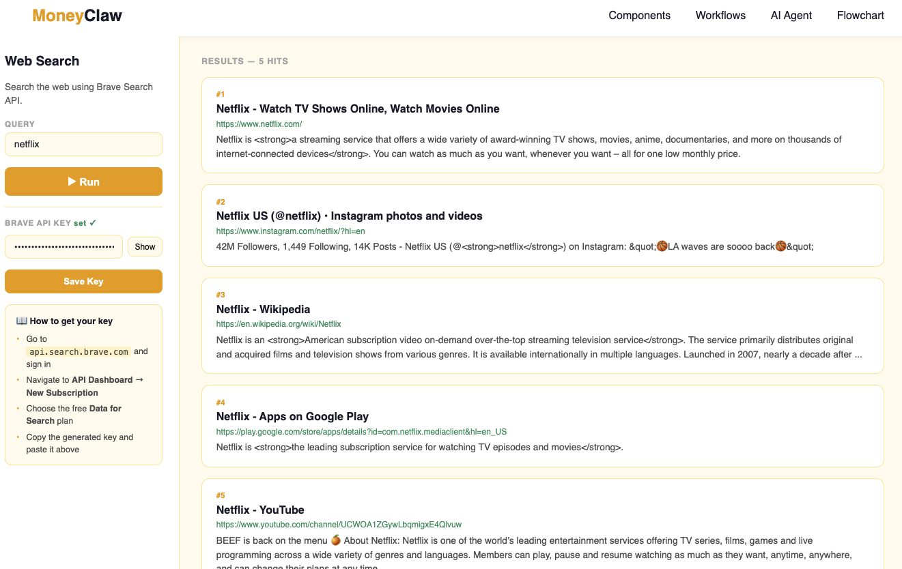
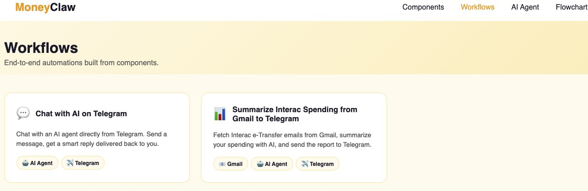
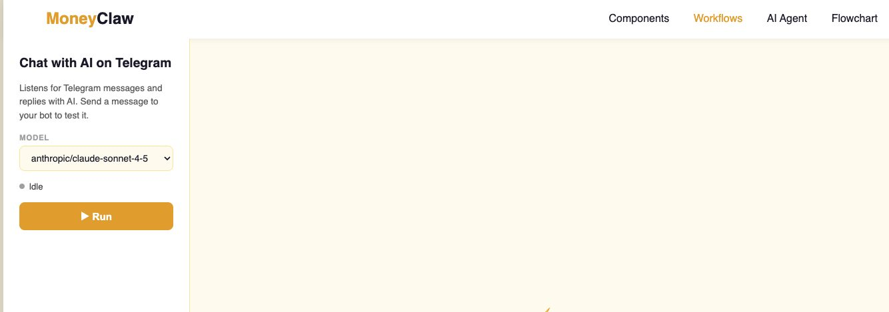

# MoneyClaw

Optimize your spending with an AI-powered agent.

Run the app with `python app.py`
```

## Screenshots

**Landing Page**


**Flowchart**


**Components**


**Web Search Component**


**Workflows**


**Chat with AI on Telegram**



## AI Agent

The agent at `/agent` uses OpenRouter + LangGraph for multi-turn chat with model and personality selection.

### Getting an OpenRouter API key

- Go to [openrouter.ai](https://openrouter.ai) and sign up
- Navigate to **Keys** in your account dashboard
- Click **Create Key**, give it a name, and copy the key
- Set it as `OPENROUTER_API_KEY` in your environment before running the app
- OpenRouter supports free-tier models — no credit card needed to start

## Gmail Component

The Gmail component at `/gmail` reads emails from your Google account using the Gmail API.

### Setting up Google API credentials

- Go to https://console.cloud.google.com and sign in
- Create a new project (top-left dropdown → **New Project**)
- In the left menu go to **APIs & Services → Library**, search for **Gmail API**, and click **Enable**
- Go to **APIs & Services → OAuth consent screen**
  - Choose **External**, fill in app name and your email, save
  - Under **Scopes** add `https://www.googleapis.com/auth/gmail.readonly`
  - Under **Test users** add your Gmail address
- Go to **APIs & Services → Credentials → Create Credentials → OAuth client ID**
  - Application type: **Desktop app**, give it a name, click **Create**
- Click **Download JSON** on the created credential and save it as `credentials.json` in the project root
- On first run the app will open a browser window asking you to authorize — after that a `token.json` is saved and reused automatically

## Notion Component

The Notion component at `/notion` views and edits the AgentWatson page.

### Getting a Notion API key

- Go to https://www.notion.so/my-integrations and sign in
- Click **+ New integration**, give it a name (e.g. `MoneyClaw`), select your workspace, click **Submit**
- Copy the **Internal Integration Secret** — this is your `NOTION_API_KEY`
- Add it to your `.env`: `NOTION_API_KEY=secret_xxx...`
- Open your page in Notion
- Click the **⋯** menu (top-right) → **Connect to** → select your integration
- The integration now has access to read and edit that page

## Telegram Component

The Telegram component at `/telegram` sends messages to yourself via a bot.

### Setting up a Telegram bot

- Open Telegram and search for **@BotFather**
- Send `/newbot`, follow the prompts to pick a name and username
- BotFather gives you a token — add it to `.env`: `TELEGRAM_BOT_TOKEN=123456:ABC-xxx`
- To get your Chat ID: search for **@userinfobot** in Telegram and send it any message — it replies with your ID
- Add it to `.env`: `TELEGRAM_CHAT_ID=123456789`
- Leave the Chat ID field blank in the UI to use the default from `.env`

## Web Search Component

The Web Search component at `/search` uses the Brave Search API.

### Getting a Brave Search API key

- Go to https://api.search.brave.com and sign in with a Brave account
- Navigate to **API Dashboard → New Subscription** and choose the free **Data for Search** plan
- Copy the generated API key
- Add it to your `.env`: `BRAVE_API_KEY=BSA...`

